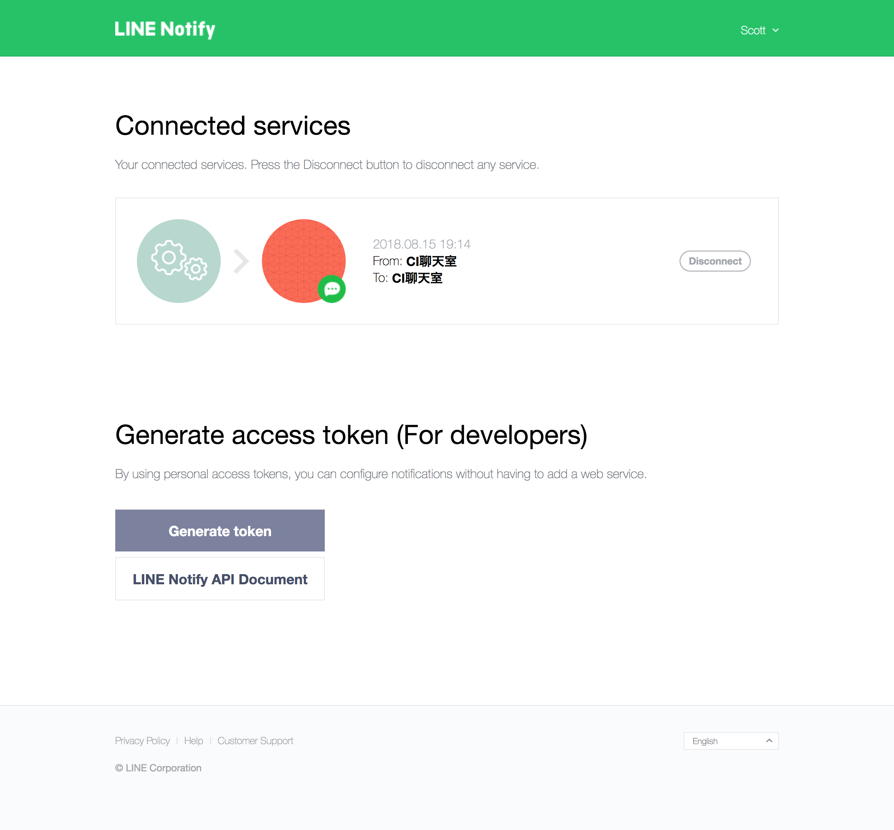

[](https://raw.githubusercontent.com/o1lab/xmysql/master/LICENSE)

# Docker-line-notify : A quick way to trigger your Line Notification by RESTFul API

# Why this ?

To help developers to talk with Line chatbot.

# Get the access_token
1. Go to [https://notify-bot.line.me](https://notify-bot.line.me)
2. Login
3. Go to [https://notify-bot.line.me/my/](https://notify-bot.line.me/my/) 
4. Click Generate Token 
5. Copy the generated token

# Setup by docker

```
docker run -d -p 8000:3000 --env default_access_token=YOUR_DEFAULT_TOKEN --env default_message=HelloWorld mymislife/docker-line-notify
```

# Usage by curl
```
curl http://localhost:8000 -X POST -H "Content-Type: application/json" -d '{"message":"I am robot!"}'
```
```
curl http://localhost:3000 -X POST -H "Content-Type: application/json" -d '{"message":"I am robot!", "access_token": "YOUR_NEW_TOKEN"}'
```

# Hint
If your service has been set the default_access_token, every time you invoke the service, you don't have to carry to token.

# Docker environment variables
    default_access_token: String,
    default_message: String

# RESTFul API
Request URL: http://localhost:8000,
Method: POST,
Content-Type: application/json,
Data:
    access_token: "",
    message: ""

# License declaration
This open source is MIT-based.
The rest of license and right should be referred to [https://line.me](Line corporation).